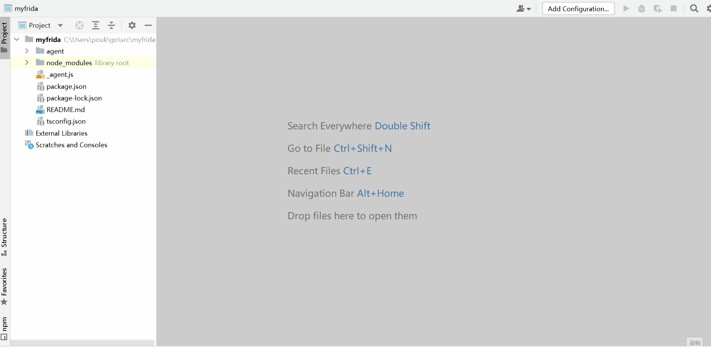

## fd 

## single exe frida debug tool,supper webstorm

supper system :
    
- windows x64
- linux x64


#### Now he only supports USB

[简体中文直接点这里](./README.MD)

#### [The precompiled binary is downloaded here](https://github.com/a97077088/fd/releases)

#### [预编译的二进制文件在这里下载](https://github.com/a97077088/fd/releases)


#### Support List:

- create frida-agent-example application
- run (webstorm debug,It's like development engineering)
- compile (compile script to byte file)
- lsapp (show list application)
- lsps (show list process)
- api (export api to http/grpc)


### create frida-agent-example application
```
cd ~/src
fd create myfrida
cd myfrida
npm install
fd run _agent.js -name 通讯录
```


### run 

### run _agent.js -name 通讯录

##### * 支持下载文件功能,例如:

````
send({"type":"download","path":"test/test.txt","append":true},new Uint8Array([0x01]).buffer);
````

##### 支持本地资源访问: 把资源放入:agent/box文件夹,可以使用以下代码访问:
````
import {Box} from "./box";
Box.String("1.txt")
Box.Uint8Array("1.txt")
````

```
cd ~/src
fd create myfrida
cd myfrida
npm install
webstorm run _agent.js
Run/Debug Configurations 
1.replace Node interpreter to fd
2.set Node parameters "run"
3.set Application parameters "-name 通讯录"
4.Now it's working properly
```

### run (webstorm debug,It's like development engineering)


download file example:
```
send({"type":"download","filename":"dd","append":true},new Uint8Array([0x01]).buffer)
```

```
cd ~/src
fd create myfrida
cd myfrida
npm install
fd run _agent.js -name 通讯录
```

### compile (compile script to byte file)

```
cd ~/src
fd create myfrida
cd myfrida
npm install
fd compile _agent.js -name 通讯录
New file _agent.compile.js appears in the current directory
```

### lsapp (show list application)
```
fd lsapp
All applications are now listed
```

### lsps (show list process)
```
fd lsapp
All process are now listed
```

### api (export api to http/grpc)
```
fd api api.js -name 通讯录 -address :8080
Now you can call the API in a format like the following


POST /call HTTP/1.1
Host: localhost:8081
User-Agent: Charles/4.6.1
Content-Type: text/json
Content-Length: 63

{
    "func":"add",
    "args":[1,2],
    "timeout":"30s"
}
ret:
{
	"code": 0,
	"msg": "操作成功",
	"data": 3
}
```


```
fd --help

============== 创建工程 使用方法:create pdir

============== 脚本调试 使用方法:run 1.js -name 通讯录
-jsbyte
是否使用编译过的js 字节码
-name string
调试进程名称,比如 通讯录,(lsps的结果中可以看到)

============== 脚本编译 使用方法:compile 1.js -name 通讯录
-name string
app屏幕上看到的名字,比如 通讯录,(lsps的结果中可以看到)

============== 列出所有application 使用方法:lsapp

============== 列出所有进程 使用方法:lsps

============== api导出 使用方法:api 1.js -name 通讯录
-address string
接口监听地址 (default ":8080")
-grpc
导出grpc接口(暂时还不支持)
-http
导出http接口 (default true)
-jsbyte
是否使用编译过的js 字节码
-name string
app屏幕上看到的名字,比如 通讯录,(lsps的结果中可以看到)
-path string
api监听路径 (default "/call")
```