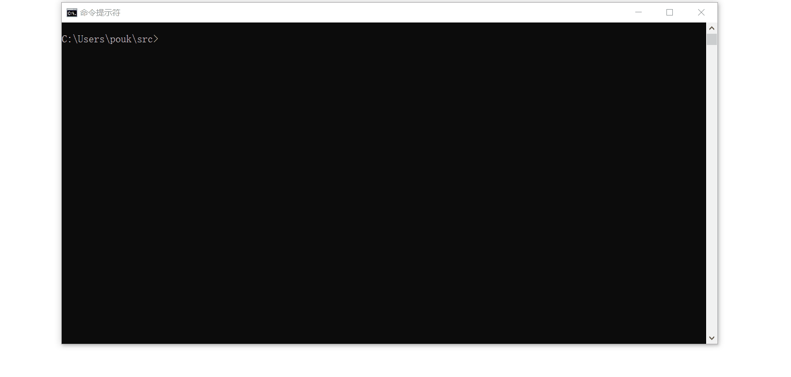
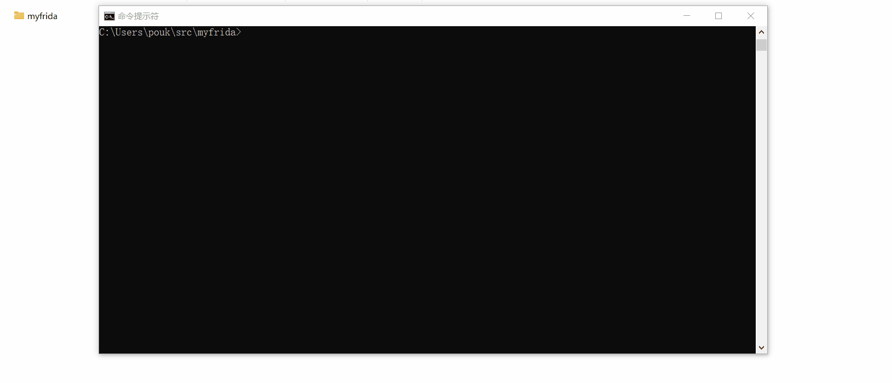

## fd    

##### frida 运行时(不需要python,只有单一个文件)

##### fd 使用fd前请确认手机上有frida-server

#### [预编译的二进制文件在这里下载](https://github.com/a97077088/fd/releases)

#### 什么是frida:
- **世界顶级全平台逆向动态调试框架**
- **使用javascript脚本动态hook,trace本机指令**
- **详细文档地址: https://frida.re/**


#### 什么是fd:
- **单文件的frida运行时(客户端),他不需要python和nodejs支持,使用golang开发**
- **主要作为frida运行时使用,例如导出api**

#### 开始使用
- #### ios脱壳:
````
1. 打开 Cydia 
2. 添加软件源: https://build.frida.re
3. 搜索: frida 并且安装
4. 根据系统下载fd: https://github.com/a97077088/fd/releases
5. 数据线链接到电脑
6. fd bagbak 通讯录 //通讯录需要手动打开并且置于前台
//Contacts.app现在出现在你的目录
````

- #### 安卓显示所有app:
````
1. 打开 Magisk 
2. 安装: MagiskFrida
3. 根据系统下载fd: https://github.com/a97077088/fd/releases
4. 数据线链接到电脑
5. fd lsapp
//app列表应该显示在你的机器上
````

- #### 显示本机所有进程:
````
1. 根据系统下载fd: https://github.com/a97077088/fd/releases
2. 数据线链接到电脑
3. fd lsps -devi=local
//ps列表应该显示在你的机器上
````


- #### 使用webstorm开发:
````
1. 根据系统下载fd: https://github.com/a97077088/fd/releases
2. fd create testproject
3. cd myfrida
4.npm install
5.打开webstorm 点击:Run/Debug Configurations 
    1.设置 Node interpreter 为 fd
    2.设置 Node parameters "run"
    3.设置 Application parameters "-name 通讯录"
6.点击webstorm的运行按钮
//现在他就像在开发应用一样方便调试
````

#### fd具体功能
- **fd ios脱壳工具(fd bagbak) [阅读文档]()** **ipa 脱壳,集成了bagbak插件,支持拓展文件脱壳,他不需要ssh  [ChiChou/bagbak](https://github.com/ChiChou/bagbak)**
- **fd 创建工程(fd create) [阅读文档]()** **创建基于tyescripts的frida-agent-example 工程,拥有完美智能提示 [oleavr/frida-agent-example](https://github.com/oleavr/frida-agent-example)**
- **fd 导出api(fd api) [阅读文档]()** **轻松导出exports为 http 或 grpc接口调用**
- **fd 显示app列表(fd lsapp) [阅读文档]()** **显示所有app列表**
- **fd 显示进程列表(fd lsps) [阅读文档]()** **显示所有进程列表**
- **fd 显示设备列表(fd lsdev) [阅读文档]()** **显示设备列表**
- **fd 编译byte(fd compile) [阅读文档]()** **编译脚本为byte code**
- **fd 运行js(fd run) [阅读文档]()** **集成webstorm,就像开发工程一样使用frida调试,智能提示,错误报告等**

#### fd 使用了哪些框架:
- **核心基础部分基于 frida 世界顶级全平台逆向动态调试框架 [项目地址](https://frida.re/)**
- **核心部分基于 frida-go 他是纯golang绑定的frida-core客户端 [a97077088/frida-go](https://github.com/a97077088/frida-go)**
- **跨平台动态库来自 [ying32/dylib],他兼容三个平台的动态库(https://github.com/ying32/dylib)**
- **tempdll技术提取自 [ying32/govcl],这是一个强大的golang原生ui库**
- **使用google开发的 [golang语言](https://golang.org/) 开发**


[english click here](./EREADME.MD)


### BagBak 脱壳

### bagbak 通讯录

```
usb: fd bagbak 通讯录
本机: fd bagbak 通讯录 -devi local
远程主机: fd bagbak 通讯录 -devi 127.0.0.1:1234
```

### 创建frida工程

### create frida-agent-example
```
cd ~/src
fd create myfrida
cd myfrida
npm install
fd run agent.js -name 通讯录
```



### 运行js到设备

### run agent.js -name 通讯录

##### * 支持下载文件功能,例如: 

````
send({"type":"download","path":"test/test.txt","append":true},new Uint8Array([0x01]).buffer);
````

##### 支持本地资源访问: 把资源放入:agent/box文件夹,可以使用以下代码访问:
````
import {Box} from "./box";
Box.String("1.txt")
Box.Uint8Array("1.txt")
````

```
cd ~/src
fd create myfrida
cd myfrida
npm install
webstorm run agent.js
Run/Debug Configurations 
1.replace Node interpreter to fd
2.set Node parameters "run"
3.set Application parameters "-name 通讯录"
4.Now it's working properly
```

### run (webstorm debug,It's like development engineering)

.buffer)
```

```
cd ~/src
fd create myfrida
cd myfrida
npm install
fd run agent.js -name 通讯录
```

### 编译脚本到byte

### compile agent.js -name 通讯录



```
cd ~/src
fd create myfrida
cd myfrida
npm install
fd compile agent.js -name 通讯录
New file _agent.compile.js appears in the current directory
```

### 列出所有设备上的application

### lsapp

```
fd lsapp
All applications are now listed
```

### 列出设备上所有ps

### lsps

```
fd lsapp
All process are now listed
```

### 导出api到http或grpc

### api (export api to http/grpc)

```
fd api api.js -name 通讯录 -address :8080
Now you can call the API in a format like the following


POST /call HTTP/1.1
Host: localhost:8081
User-Agent: Charles/4.6.1
Content-Type: text/json
Content-Length: 63

{
    "func":"add",
    "args":[1,2],
    "timeout":"30s"
}
ret:
{
	"code": 0,
	"msg": "操作成功",
	"data": 3
}
```


### 运行帮助

```
fd --help

============== 创建工程 使用方法:create pdir

============== 脚本调试 使用方法:run 1.js -name 通讯录
-jsbyte
是否使用编译过的js 字节码
-name string
调试进程名称,比如 通讯录,(lsps的结果中可以看到)

============== 脚本编译 使用方法:compile 1.js -name 通讯录
-name string
app屏幕上看到的名字,比如 通讯录,(lsps的结果中可以看到)

============== 列出所有application 使用方法:lsapp

============== 列出所有进程 使用方法:lsps

============== api导出 使用方法:api 1.js -name 通讯录
-address string
接口监听地址 (default ":8080")
-grpc
导出grpc接口(暂时还不支持)
-http
导出http接口 (default true)
-jsbyte
是否使用编译过的js 字节码
-name string
app屏幕上看到的名字,比如 通讯录,(lsps的结果中可以看到)
-path string
api监听路径 (default "/call")
```