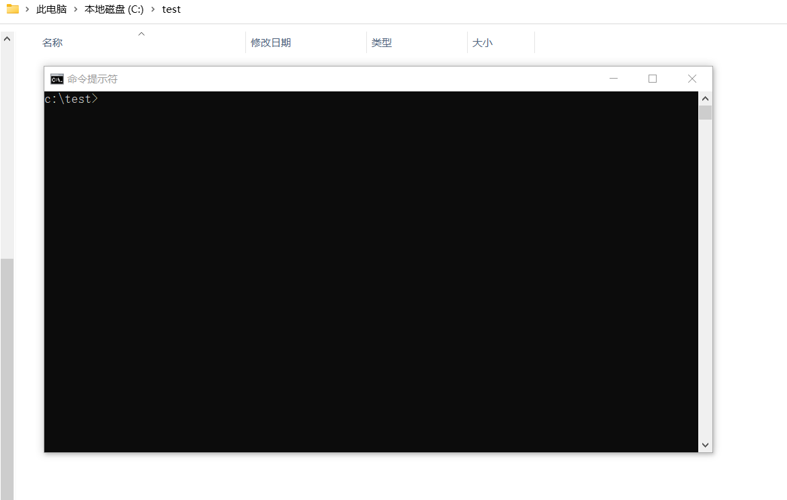

## fd   

#### 简要介绍 
* **English can use chrome translation or [click english doc](README_EN.MD)**
* **frida 运行时(不需要python,只有单一个文件)**
* **fd 使用fd前请确认手机上有frida-server**
* **优雅的使用webstorm开发(拥有智能完美的智能提示,内置了一些调试库) **
* **支持资源嵌入,CModule嵌入 **


#### a brief introdction
* **frida runtime (no python required, only a single file)**
* **fd need you phone require frida-server**

#### [预编译的二进制文件在这里下载](https://github.com/a97077088/fd/releases)



#### 什么是frida:
- **世界顶级全平台逆向动态调试框架**
- **使用javascript脚本动态hook,trace本机指令**
- **详细文档地址: https://frida.re/**


#### 什么是fd:
- **单文件的frida运行时(客户端),他不需要python和nodejs支持,使用golang开发**
- **主要作为frida运行时使用,例如导出api**
- **fd支持 远程主机,指定devi,frida中的-H功能,相信查看文档[阅读图文教程](md/bagbak.md)**
- **fd内置了ios脱壳工具bagbak,详细查看文档[阅读图文教程](md/bagbak.md)**
- **fd 支持在webstorm中直接开发，详细查看文档[阅读图文教程](md/run.md)**
- **fd 支持 api 一键导出http接口 详细查看文档[阅读图文教程](md/api.md)**

#### 开始使用
- #### ios脱壳:
````
1. 打开 Cydia 
2. 添加软件源: https://build.frida.re
3. 搜索: frida 并且安装
4. 根据系统下载fd: https://github.com/a97077088/fd/releases
5. 数据线链接到电脑
6. fd bagbak 通讯录 //通讯录需要手动打开并且置于前台,fd仅以附加模式工作
7. 或者: fd bagbak com.apple.MobileAddressBook //通讯录需要手动打开并且置于前台,fd仅以附加模式工作
//Contacts.app现在出现在你的目录
````

- #### 安卓显示所有app:
````
1. 打开 Magisk 
2. 安装: MagiskFrida
3. 根据系统下载fd: https://github.com/a97077088/fd/releases
4. 数据线链接到电脑
5. fd lsapp
//app列表应该显示在你的机器上
````

- #### 显示本机所有进程:
````
1. 根据系统下载fd: https://github.com/a97077088/fd/releases
2. 数据线链接到电脑
3. fd lsps -devi=local
//ps列表应该显示在你的机器上
````


- #### 使用webstorm开发:
````
1. 根据系统下载fd: https://github.com/a97077088/fd/releases
2. fd create testproject
3. cd myfrida
4.npm install
5.打开webstorm 点击:Run/Debug Configurations 
    1.设置 Node interpreter 为 fd
    2.设置 Node parameters "run"
    3.设置 Application parameters "-name 通讯录"
6.点击webstorm的运行按钮
//现在他就像在开发应用一样方便调试
````

#### fd具体功能
- **fd ios脱壳工具(fd bagbak) [阅读图文教程](md/bagbak.md)** **ipa 脱壳,集成了bagbak插件,支持拓展文件脱壳,他不需要ssh  [ChiChou/bagbak](https://github.com/ChiChou/bagbak)**
- **fd 创建工程(fd create) [阅读图文教程](md/create.md)** **创建基于tyescripts的frida-agent-example 工程,拥有完美智能提示 [oleavr/frida-agent-example](https://github.com/oleavr/frida-agent-example)**
- **fd 导出api(fd api) [阅读图文教程](md/api.md)** **轻松导出exports为 http 或 grpc接口调用**
- **fd 显示app列表(fd lsapp) [阅读图文教程](md/lsapp.md)** **显示所有app列表**
- **fd 显示进程列表(fd lsps) [阅读图文教程](md/lsps.md)** **显示所有进程列表**
- **fd 显示设备列表(fd lsdev) [阅读图文教程](md/lsdev.md)** **显示设备列表**
- **fd 编译byte(fd compile) [阅读图文教程](md/compile.md)** **编译脚本为byte code**
- **fd 运行js(fd run) [阅读图文教程](md/run.md)** **集成webstorm,就像开发工程一样使用frida调试,智能提示,错误报告等**

#### fd 使用了哪些框架:
- **核心基础部分基于 frida 世界顶级全平台逆向动态调试框架 [项目地址](https://frida.re/)**
- **核心部分基于 frida-go 他是纯golang绑定的frida-core客户端 [a97077088/frida-go](https://github.com/a97077088/frida-go)**
- **跨平台动态库来自 [ying32/dylib],他兼容三个平台的动态库(https://github.com/ying32/dylib)**
- **tempdll技术提取自 [ying32/govcl],这是一个强大的golang原生ui库**
- **使用google开发的 [golang语言](https://golang.org/) 开发**


### 运行帮助

```
fd --help

============== 列出所有设备 使用方法:lsdev

============== 创建工程 使用方法:create pdir

============== 脚本调试 使用方法:run 1.js -name 通讯录
  -devi string
        设备
  -jsbyte
        是否使用编译过的js 字节码
  -name string
        调试进程名称,比如 通讯录,(lsps的结果中可以看到)
  -pid uint
        进程pid

============== 脚本编译 使用方法:compile 1.js -name 通讯录
  -devi string
        设备
  -name string
        app屏幕上看到的名字,比如 通讯录,(lsps的结果中可以看到)

============== 列出所有application 使用方法:lsapp
  -devi string
        设备

============== 列出所有进程 使用方法:lsps
  -devi string
        设备

============== api导出 使用方法:api 1.js -name 通讯录
  -address string
        接口监听地址 (default ":8080")
  -devi string
        设备
  -grpc
        导出grpc接口(暂时还不支持)
  -http
        导出http接口 (default true)
  -jsbyte
        是否使用编译过的js 字节码
  -name string
        app屏幕上看到的名字,比如 通讯录,(lsps的结果中可以看到)
  -path string
        api监听路径 (default "/call")

============== bagbak(ipa脱壳) 使用方法:bakbag 通讯录
  -devi string
        设备
  -pid uint
        进程id
```